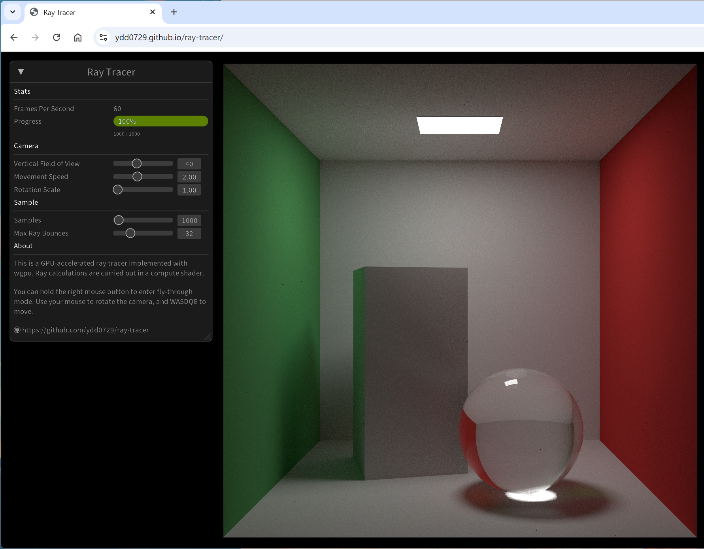
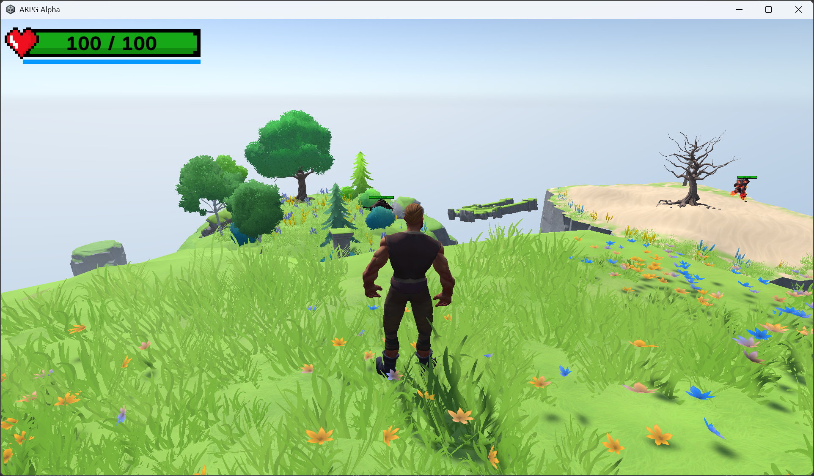
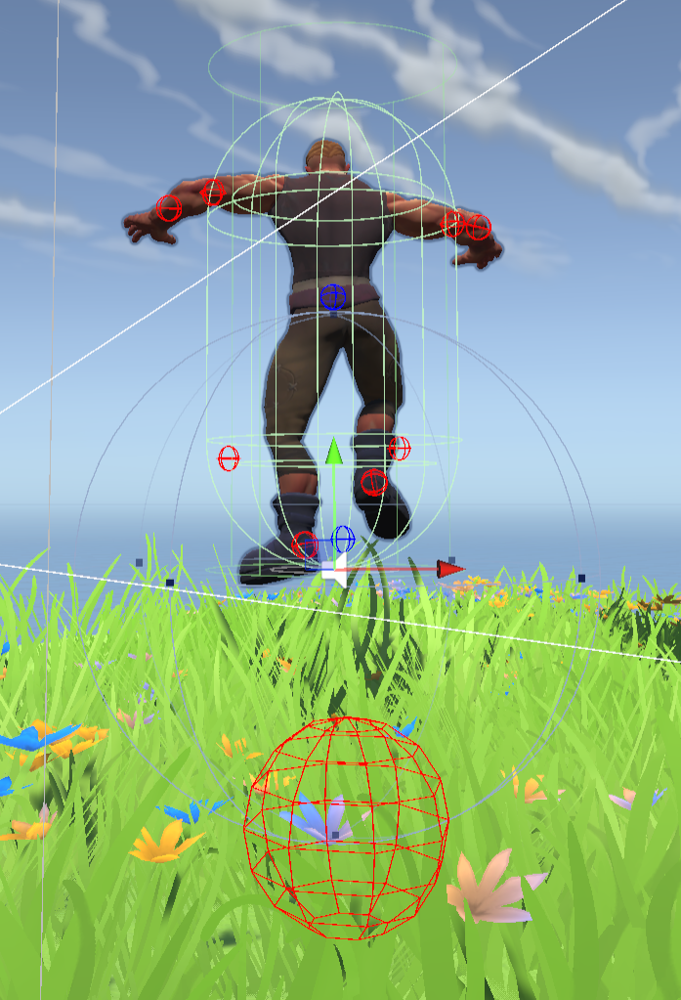
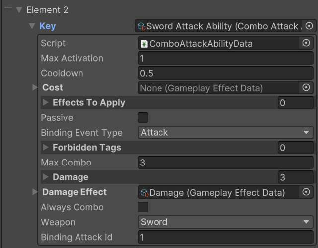
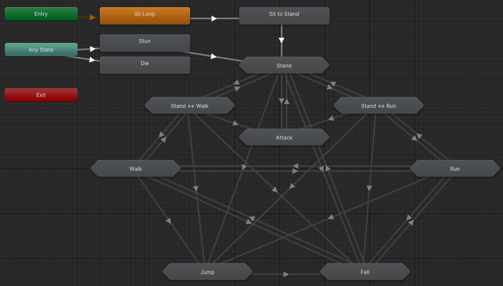
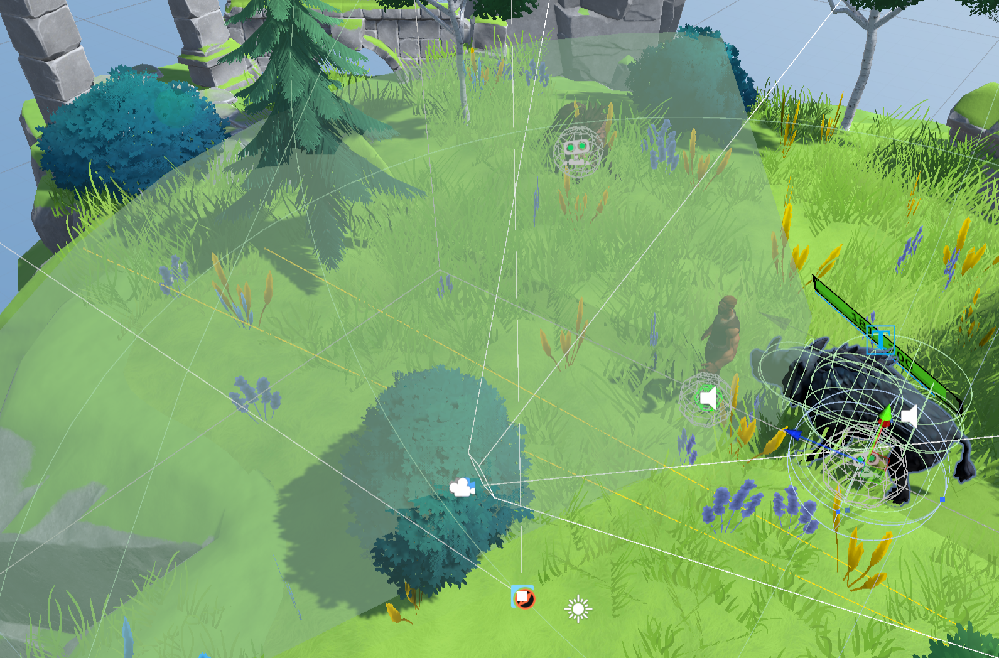
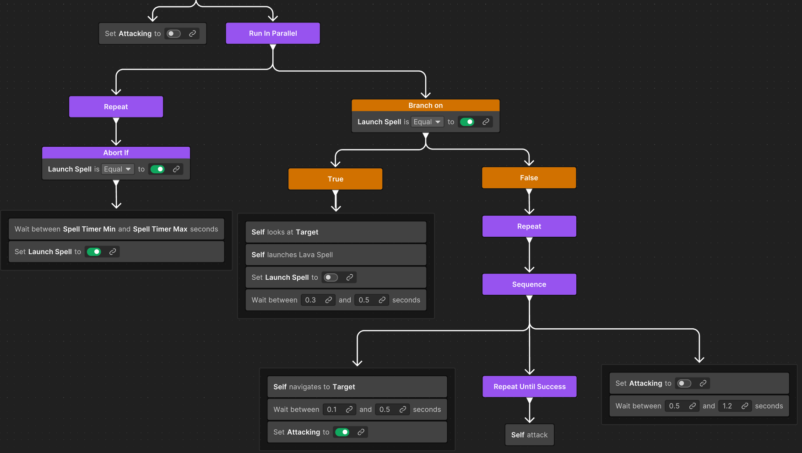

# Portfolio

## Ray Tracer

- Year: **2024**
- **Personal Project**
- Repository: [**https://github.com/ydd0729/ray-tracer**](https://github.com/ydd0729/ray-tracer)
- Online demo: [**https://ydd0729.github.io/ray-tracer**](https://ydd0729.github.io/ray-tracer)

Ray Tracer is a graphics program that renders a classic Cornell box with the latest tech stack. Implemented with Rust and [wgpu](https://github.com/gfx-rs/wgpu), this program can run both locally and in a browser.

**NOTE:** 

- If you want to try out the online demo, please use a web browser that supports WebGPU. Most recent modern web browsers should work fine. The latest Chrome on Android devices should also work, but I haven't tested it. 
- You can enter fly-through mode in the same way as you do in Unity Editor or Unreal Engine Editor.

### Overview

This project is a Rust implementation of Peter Shirley's [*Ray Tracing in One Weekend Book Series*](https://github.com/RayTracing/raytracing.github.io?tab=readme-ov-file#ray-tracing-in-one-weekend-book-series). While there are many other attempts to reimplement the book's code in other languages on GitHub, the features listed below make my work unique, at least for now:

- This project makes use of wgpu. Ray calculations are carried out in a compute shader along with  techniques like importance sampling, making it fairly fast to converge to a nice-looking view.
- I implemented all the advanced techniques introduced in the third book, *Ray Tracing: The Rest of Your Life*, and Bounding Volume Hierarchy Tree discussed in the second book in WGSL.
- I referenced a few other papers in order to implement ray tracing in WGSL and further improve performance:
  - [Efficient pseudo-random number generation for monte-carlo simulations using graphic processors](https://iopscience.iop.org/article/10.1088/1742-6596/368/1/012024/pdf)
  - [Efficient Stack-less BVH Traversal for Ray Tracing](https://www.sci.utah.edu/~wald/Publications/2011/StackFree/sccg2011.pdf)
  - [Efficiently Building a Matrix to Rotate One Vector to Another](https://cs.brown.edu/people/jhughes/papers/Moller-EBA-1999/paper.pdf)

## ARPG Alpha

- Year: **2024**
- Repository: [**https://github.com/ydd0729/ArpgAlpha**](https://github.com/ydd0729/ArpgAlpha)
- Online Demo: [**https://ydd0729.github.io/ArpgAlpha**](https://ydd0729.github.io/ArpgAlpha/)

ARPG Alpha is a ARPG demo game made with Unity.

**NOTE:** 

- The online demo may take a few minutes to download its content.
- The online demo looks different from the screenshot above, because I didn't realize that the shaders were not supported by WebGL until a very late stage. So I replaced the shader with Unity's standard shader, and reworked the terrains. My work **doesn't** include these shaders.

### My Work

I completed this project on my own, but most game assets are purchased or gathered from the Internet.

Simply put, my work includes **everything relevant to gameplay logic**:

- All C# scripts, except those under `Assets/Plugin`
- All characters' animation controllers
- World building
- AI navigation
- AI sensor
- Behavior graphs
- Prefabs for use in gameplay
- Audio mixers

**NOT** my work: meshes, shaders, materials, audio clips, animation clips, UI sprites, visual effects.

### Overview

#### Story

This game has a quite simple plot about the player character who ventures through a relic, gains a sword and power from a lost civilization, and finally helps them defeat Flame Demon who destroyed their lands.

#### Audio System

All `AudioSource`s on a `GameObject` are managed by an  `AudioManager` ，which uses object pool pattern to dynamically create and reuse `AudioSource` components.

All audio clips are categorized into `AudioContainer`s. The `AudioManager` can enumerate an `AudioContainer` in three ways, which are `Random`，`Sequential`,  and `Shuffled` . I find the `Random` pattern is extremely useful,  as randomization can be added virtually everywhere in terms of sound effects in game,  such as footstep sounds, attack sounds, or explosions.

Footstep sounds have extra mechanics to achieve environment perception. A sphere is cast from character's feet to detect ground. Footsteps sounds depend on the tag of the ground object, such as `Grass`, `Stone`, or `Sand`. 

#### Ability System

I migrated my knowledge and experience working with Unreal Engine's [Gameplay Ability System](https://dev.epicgames.com/documentation/en-us/unreal-engine/gameplay-ability-system-for-unreal-engine) to the development of this game. Instead of reimplementing the entire system, I referenced some high-level concepts to create my own ability system:

- **GameplayAttribute**: a float value representing a gameplay attribute, such as health.
- **GameplayEffect**: an effect to be applied to manipulate `GameplayAttribute`s
- **GameplayAbility**: an ability to be granted and activated to perform any actions. 
- **GameplayAbilitySystem**: the top-level component to do things listed above and interact with other `GameplayAbilitySystem`.

I also integrated Unity's `ScriptableObject`  into this ability system, which significantly improves flexibility and usability. For example, every normal attack skill in this game is an instance of  `ComboAttackAbility`.

#### Animation

I created an elaborate animation controller for the player character. The locomotion system feels smooth and natural.

#### AI Sensor

NPCs need to first sense objects around them to react. I implemented a visual sensor for this purpose.

The visual sensor detects a fan shaped volume, any target overlapped with this volume is considered as being seen by the NPC. This information will then be sent to NPC's "brain", the behavior graph.

#### Behavior Graph

Unity Behavior is Unity's latest visual tool for authoring behaviors used to control non-player character or objects. The screenshot above is part of Flame Demon's behavior graph, which describes its actions when it finds a target.